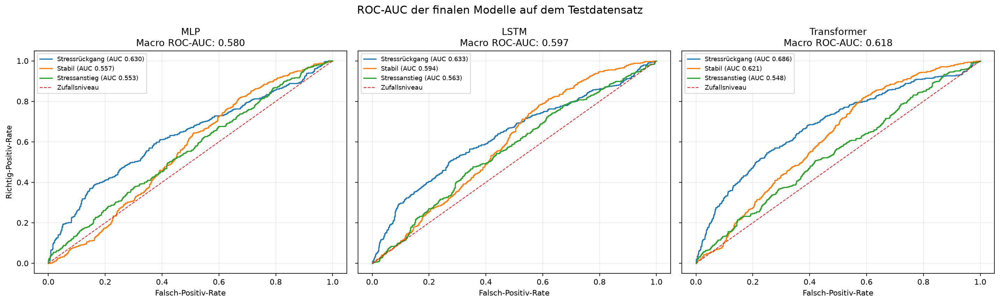
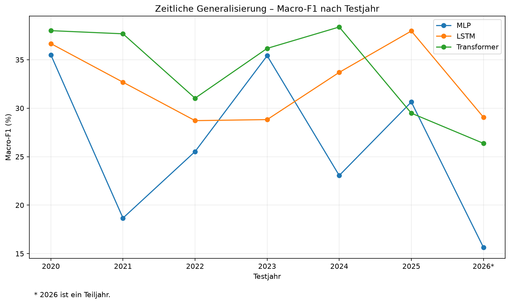
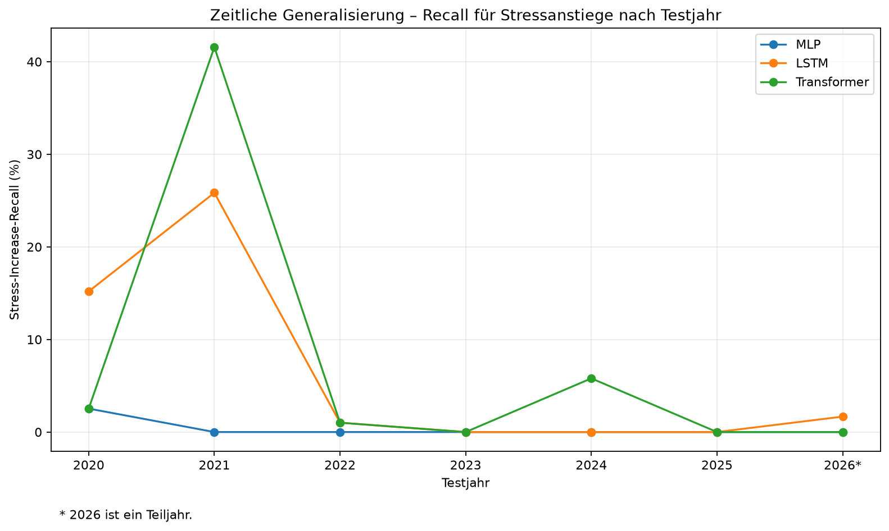

# Financial Stress Regime Forecasting with PyTorch

Reproduzierbarer Deep-Learning-Forschungsprototyp zur Klassifikation zukünftiger Finanzstressregime mit realen OFR-Finanzmarktdaten, chronologischer Evaluation und einem Vergleich von MLP, LSTM und Transformer.

**Version:** 1.0.0
**Status:** abgeschlossenes Portfolio- und Abschlussprojekt
**Schwerpunkt:** Financial AI · Deep Learning · PyTorch · Time Series · Transformer

## Forschungsfrage

> Kann ein PyTorch-Transformer anhand der vorherigen 60 Handelstage multivariater Finanzstressdaten klassifizieren, ob der Finanzstress über die folgenden fünf Handelstage sinkt, stabil bleibt oder steigt?

## Wichtigste Ergebnisse

Finale Evaluation auf dem chronologisch zurückgehaltenen Testzeitraum vom 02.01.2020 bis 29.07.2026:

| Modell | Accuracy | Macro-F1 | Recall Stress Increase | Macro ROC-AUC |
|---|---:|---:|---:|---:|
| MLP | **43,92 %** | 33,44 % | 0,37 % | 0,5801 |
| LSTM | 41,79 % | 36,43 % | 6,89 % | 0,5970 |
| Transformer | 42,44 % | **37,38 %** | **8,19 %** | **0,6183** |
| Majority-Baseline | 30,64 % | 15,63 % | 0,00 % | – |

Die Accuracy allein würde das MLP bevorzugen. Bei der für dieses Projekt wichtigeren ausgewogenen Klassenleistung führt jedoch der Transformer: Er erreicht den höchsten Macro-F1, den höchsten Recall für `Stress Increase` und die höchste Macro-ROC-AUC der drei neuronalen Modelle.

Die Ergebnisse bleiben bewusst moderat. Das Projekt demonstriert einen methodisch sauberen Financial-AI-Forschungsworkflow, aber kein produktionsreifes Frühwarn- oder Trading-System.



## Zentrale Erkenntnisse

- Der Transformer ist nach der finalen Evaluation das stärkste neuronale Modell bei **Macro-F1**, **Stress-Increase-Recall** und **Macro-ROC-AUC**.
- Das MLP besitzt mit 43,92 % die höchste Accuracy, erkennt Stressanstiege aber nahezu gar nicht.
- Die LSTM-Hyperparameter wurden ausschließlich auf Validation-Daten ausgewählt. Eine zusätzliche Drei-Seed-Prüfung zeigte deutliche Seed-Sensitivität.
- Die jahresweise Testanalyse zeigt starke zeitliche Schwankungen und damit relevante Nichtstationarität.
- Stressanstiege bleiben für alle Modelle die schwierigste Zielklasse.
- Attention unterstützt die Interpretation zeitlicher Beziehungen, beweist aber keine Kausalität oder Feature Importance.
- Kleine synthetische Eingabestörungen verändern die Transformer-Leistung nur begrenzt; stärkere Störungen führen zu sichtbar schwächeren Ergebnissen.

## Datengrundlage und eingefrorener Snapshot

Verwendet wird der **Financial Stress Index des Office of Financial Research (OFR)**.

Der für Version 1.0.0 eingefrorene Analysesnapshot umfasst:

- 6.730 Beobachtungen
- Zeitraum: 03.01.2000 bis 05.08.2026
- 9 numerische OFR-Features
- keine fehlenden Werte
- keine doppelten Datumswerte
- chronologische Sortierung

Features:

1. `OFR FSI`
2. `Credit`
3. `Equity valuation`
4. `Safe assets`
5. `Funding`
6. `Volatility`
7. `United States`
8. `Other advanced economies`
9. `Emerging markets`

Zur Reproduzierbarkeit wird der Snapshot über Enddatum, Zeilenzahl und Hash geprüft.

```text
Snapshot-Zeilen: 6730
Snapshot-Ende:   2026-08-05
Canonical SHA-256:
38535be9eadd819493c3b77e11885deb14e344d97007551f87c76700cc829c9c

SHA-256 der verwendeten Rohdatei:
2d4a955fb0d72993fae454a731628d1deb4aca980a19121b989e80de09bf8478
```

Spätere OFR-Daten werden für diese Projektversion nicht automatisch in die Analyse übernommen.

## Zielvariable

```text
zukünftige Stressänderung
=
Mittelwert der nächsten 5 OFR-FSI-Werte
-
aktueller OFR-FSI-Wert
```

Klassen:

```text
0 = Stress Decrease
1 = Stable
2 = Stress Increase
```

Die Klassengrenzen werden ausschließlich aus dem Trainingszeitraum über das 1/3- und 2/3-Quantil bestimmt:

```text
untere Grenze ≈ -0,1388
obere Grenze ≈  0,0863
```

Für ein gültiges Ziel müssen alle fünf zukünftigen Beobachtungen vorhanden sein. Die Zielvariable wird separat innerhalb jedes chronologischen Splits berechnet, sodass keine Labels Split-Grenzen überschreiten.

## Chronologische Aufteilung und Leakage-Vermeidung

```text
Training:   bis Ende 2016
Validation: 2017 bis Ende 2019
Test:       ab 2020
```

Vorhersagezeiträume:

```text
Training:   28.03.2000 bis 22.12.2016
Validation: 03.01.2017 bis 23.12.2019
Test:       02.01.2020 bis 29.07.2026
```

Leakage-Schutz:

- keine zufällige Mischung von Vergangenheit und Zukunft
- Zielberechnung separat innerhalb der Splits
- `StandardScaler` ausschließlich auf Trainingsdaten fitten
- Validation und Test nur mit Trainingsparametern transformieren
- Past-only-Kontext für die ersten Validation-/Testfenster
- DataLoader mit `shuffle=False`

## Sliding-Window-Sequenzen

Jede Vorhersage verwendet `60 Handelstage × 9 Features`.

| Split | Shape | Klassen `[Decrease, Stable, Increase]` |
|---|---|---|
| Training | `(4213, 60, 9)` | `[1406, 1402, 1405]` |
| Validation | `(749, 60, 9)` | `[233, 303, 213]` |
| Test | `(1694, 60, 9)` | `[519, 638, 537]` |

## Modelle

### MLP-Baseline

```text
Flatten 60 × 9
→ Linear 540 → 128
→ ReLU + Dropout
→ Linear 128 → 64
→ ReLU + Dropout
→ Linear 64 → 3
```

Trainierbare Parameter: **77.699**

### LSTM

```text
9 Features
→ LSTM, Hidden Size 64
→ letzter Sequenzzustand
→ Linear 64 → 32
→ ReLU + Dropout
→ Linear 32 → 3
```

Trainierbare Parameter: **21.379**

Finale Konfiguration `L1`:

```text
Hidden Size:        64
Classifier Hidden:  32
Dropout:           0,20
Learning Rate:   0,0005
Batch Size:         64
```

**Zusätzliches Wissen / zusätzliche methodische Absicherung:** Die beiden LSTM-Finalisten `L1` und `L9` wurden mit den Seeds `42`, `123` und `2026` verglichen.

```text
L1: Mean Val. Macro-F1 = 0,2875 ± 0,0715
L9: Mean Val. Macro-F1 = 0,2813 ± 0,0768
```

Die Prüfung zeigt deutliche Seed-Sensitivität. Der finale LSTM-Checkpoint bleibt `L1` mit Seed 42. Das Testset wurde für diese Auswahl nicht verwendet.

### Transformer

```text
9 Features
→ Input Projection 9 → 64
→ sinusoidales Positional Encoding
→ 2 × Transformer Encoder Block
→ Mean Pooling
→ Linear 64 → 32
→ ReLU + Dropout
→ Linear 32 → 3
```

Finale Konfiguration `T1`:

```text
Model Dimension:       64
Attention Heads:        4
Encoder Layers:         2
Feed-Forward Size:    128
Classifier Hidden:     32
Dropout:             0,20
Learning Rate:     0,0005
Batch Size:            64
Trainierbare Parameter: 69.763
```

## Training und Modellauswahl

Gemeinsamer PyTorch-Workflow:

- `CrossEntropyLoss`
- Adam
- Training-/Validation-Loss und Accuracy
- Early Stopping
- Wiederherstellung des besten Modellzustands
- feste Seeds
- Device-Auswahl `CUDA → MPS → CPU`

```text
Maximum Epochs: 50
Patience:        7
Min Delta:       0,0001
```

Transformer `T1` wurde ausschließlich anhand von Validation-Macro-F1 und Validation-Loss ausgewählt:

```text
Validation Accuracy:               47,66 %
Validation Macro-F1:               41,91 %
Validation Recall Stress Increase: 18,31 %
Best Epoch:                        12
```

## Finale Testevaluation

| Modell | Accuracy | Macro Precision | Macro Recall | Macro-F1 | Increase Recall | Macro ROC-AUC |
|---|---:|---:|---:|---:|---:|---:|
| MLP | **43,92 %** | 64,36 % | 41,24 % | 33,44 % | 0,37 % | 0,5801 |
| LSTM | 41,79 % | 38,76 % | 40,94 % | 36,43 % | 6,89 % | 0,5970 |
| Transformer | 42,44 % | 40,68 % | **42,41 %** | **37,38 %** | **8,19 %** | **0,6183** |
| Majority | 30,64 % | 10,21 % | 33,33 % | 15,63 % | 0,00 % | – |

Transformer-Confusion-Matrix:

```text
[[368, 122,  29],
 [279, 307,  52],
 [256, 237,  44]]
```

## ROC-AUC

| Modell | Macro ROC-AUC | Stressrückgang | Stabil | Stressanstieg |
|---|---:|---:|---:|---:|
| MLP | 0,5801 | 0,6296 | 0,5572 | 0,5534 |
| LSTM | 0,5970 | 0,6333 | 0,5944 | **0,5632** |
| Transformer | **0,6183** | **0,6863** | **0,6207** | 0,5481 |

Der Transformer besitzt insgesamt die beste Trennfähigkeit. Die Werte liegen jedoch nur moderat über dem Zufallsniveau und werden nicht überinterpretiert.

## Zeitliche Generalisierung 2020–2026

Die finalen Modelle wurden nach Abschluss der Modellauswahl zusätzlich getrennt nach Testjahr ausgewertet. Die Analyse ist post hoc und wurde nicht zum nachträglichen Tuning genutzt.

Wichtige Beobachtungen:

- 2021: Transformer Stress-Increase-Recall **41,57 %**, LSTM **25,84 %**.
- In mehreren anderen Jahren fällt der Stress-Increase-Recall auf oder nahe 0 %.
- 2025 erreicht der LSTM Macro-F1 **37,96 %**, der Transformer 29,49 %.
- 2026 ist ein Teiljahr; alle Modelle liegen deutlich unter ihren Gesamtwerten.





Vollständige Tabelle: [`reports/temporal_generalization.md`](reports/temporal_generalization.md)

## Explainability und Fehleranalyse

Der finale Transformer kann Attention Maps zurückgeben. Analysiert wurden ein korrekt erkannter und ein falsch klassifizierter tatsächlicher Stressanstieg sowie die häufigsten Fehler.

Korrektes Beispiel:

```text
Stress Decrease: 27,77 %
Stable:          35,40 %
Stress Increase: 36,83 %
```

Falsches Beispiel:

```text
Tatsächlich:     Stress Increase
Vorhersage:      Stress Decrease

Stress Decrease: 58,34 %
Stable:          13,84 %
Stress Increase: 27,81 %
```

Attention ist eine Interpretationshilfe, aber kein Beweis für Kausalität oder direkte Feature Importance.

## Robustheit

**Zusätzliches Wissen / praktische Robustheitsimplementierung:** Der finale Transformer wurde ohne Retraining mit künstlichem Gaußschem Rauschen auf den standardisierten Testfeatures untersucht.

| Rauschen | Accuracy | Macro-F1 | Increase Recall | Prediction Agreement |
|---:|---:|---:|---:|---:|
| 0 % | 42,44 % | 37,38 % | 8,19 % | 100,00 % |
| 5 % | 42,09 % | 36,88 % | 7,64 % | 96,69 % |
| 10 % | 42,38 % | 37,31 % | 8,19 % | 92,50 % |
| 20 % | 41,15 % | 35,87 % | 7,45 % | 85,66 % |
| 50 % | 39,37 % | 32,94 % | 4,66 % | 73,32 % |

Der Test ist eine kontrollierte synthetische Störung und keine Simulation einer realen Finanzkrise.

## Limitationen

- bester Test-Macro-F1 nur 37,38 %
- sehr schwache harte Klassifikation tatsächlicher Stressanstiege
- deutliche zeitliche Schwankungen zwischen den Testjahren
- relevante LSTM-Seed-Sensitivität
- nur neun OFR-Merkmale
- fester Prognosehorizont und feste Fensterlänge
- Attention ist keine Kausalität
- synthetischer Robustheitstest bildet reale Marktbrüche nur unvollständig ab
- keine Trading-Evaluation oder Produktionsumgebung

## Fairness und Responsible AI

Der Datensatz enthält aggregierte Finanzmarktinformationen und keine personenbezogenen Merkmale. Klassische personenbezogene Fairnessmetriken sind deshalb für diese Aufgabe nicht direkt anwendbar.

Das Modell ist kein autonomes Finanzentscheidungssystem. Für eine spätere produktive Nutzung wären unter anderem Data Quality Monitoring, Drift Detection, Model Versioning, Confidence Monitoring, Fallback-Regeln und menschliche Kontrolle notwendig.

## Drei nächste Schritte

1. **Stress-Increase-Erkennung verbessern:** zusätzliche Features und alternative, ausschließlich auf Training/Validation untersuchte Ansätze.
2. **Datenbasis erweitern:** beispielsweise Zinsen, Zinsstruktur, Inflation, Arbeitsmarkt-, Kredit- und Volatilitätsdaten.
3. **Walk-Forward-Evaluation:** wiederholte chronologische Trainings-, Validierungs- und Testfenster zur robusteren Bewertung unter veränderten Marktregimen.

## Reproduzierbarkeit

- eingefrorener OFR-Snapshot mit SHA-256-Prüfung
- feste chronologische Splits
- train-only Scaling
- Zielgrenzen ausschließlich aus dem Training
- gespeicherte Checkpoints und Trainingsverläufe
- dokumentierte Hyperparameter und Seeds
- gepinnte Kernabhängigkeiten
- automatisierte Tests

Aktueller Qualitätsstand:

```text
65 passed
ruff check . → All checks passed!
git diff --check → sauber
```

## Technischer Stack

- Python 3.13
- PyTorch 2.13.0
- NumPy 2.5.1
- pandas 3.0.5
- scikit-learn 1.9.0
- Matplotlib 3.11.1
- pytest 8.4.2
- certifi 2026.07.22
- Apple MPS
- Git / GitHub

## Zentrale Befehle

```bash
pip install -e ".[dev]"
pytest -q
ruff check .
```

Evaluation:

```bash
python -m deep_learning_critical_systems.evaluation.evaluate_mlp
python -m deep_learning_critical_systems.evaluation.evaluate_lstm
python -m deep_learning_critical_systems.evaluation.evaluate_transformer
python -m deep_learning_critical_systems.evaluation.compare_models
python -m deep_learning_critical_systems.evaluation.analyze_transformer_explainability
python -m deep_learning_critical_systems.evaluation.analyze_transformer_robustness
python -m deep_learning_critical_systems.evaluation.analyze_temporal_generalization
python -m deep_learning_critical_systems.evaluation.analyze_roc_auc
```

## Ausführliche Dokumentation

- [`reports/project_description.md`](reports/project_description.md) – formale Projektbeschreibung
- [`reports/discussion.md`](reports/discussion.md) – Interpretation, Limitationen und Responsible AI
- [`reports/temporal_generalization.md`](reports/temporal_generalization.md) – Jahresanalyse 2020–2026
- [`reports/roc_auc.md`](reports/roc_auc.md) – ROC-AUC-Auswertung

## Quellen

- Office of Financial Research: OFR Financial Stress Index
  `https://www.financialresearch.gov/financial-stress-index/`
- Paul Monin (2017): *The OFR Financial Stress Index*
  `https://www.financialresearch.gov/working-papers/2017/10/25/the-ofr-financial-stability-index/`
- Vaswani et al. (2017): *Attention Is All You Need*
  `https://arxiv.org/abs/1706.03762`
- Hochreiter & Schmidhuber (1997): *Long Short-Term Memory*, Neural Computation 9(8), 1735–1780
  `https://doi.org/10.1162/neco.1997.9.8.1735`
- PyTorch: `https://pytorch.org/`
- scikit-learn: `https://scikit-learn.org/`

## Projektabgrenzung

Das Projekt ist ein reproduzierbarer **Financial-AI-Forschungsprototyp** und ausdrücklich kein autonomes Handelssystem, keine Anlageberatung, keine produktive Risikoplattform und kein Nachweis einer profitablen Trading-Strategie.

## Autor

**Maik Hübner**
AI Engineering · Machine Learning · Deep Learning · Python · PyTorch · Financial AI
