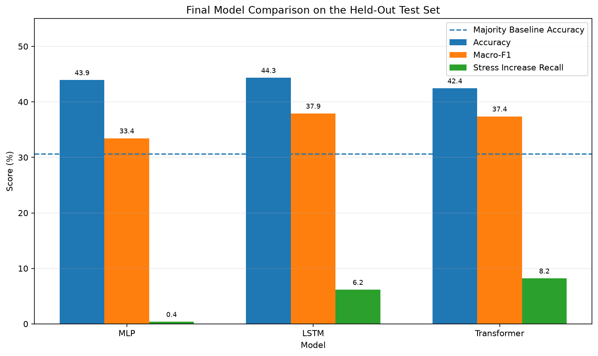
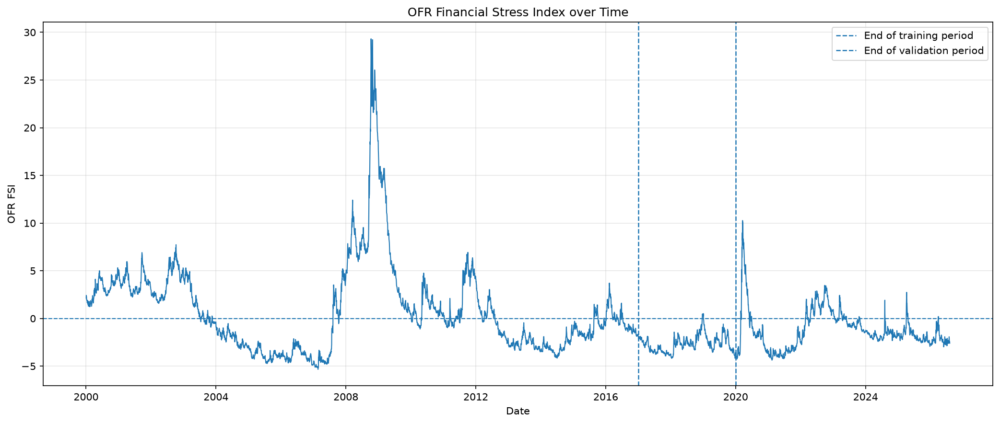
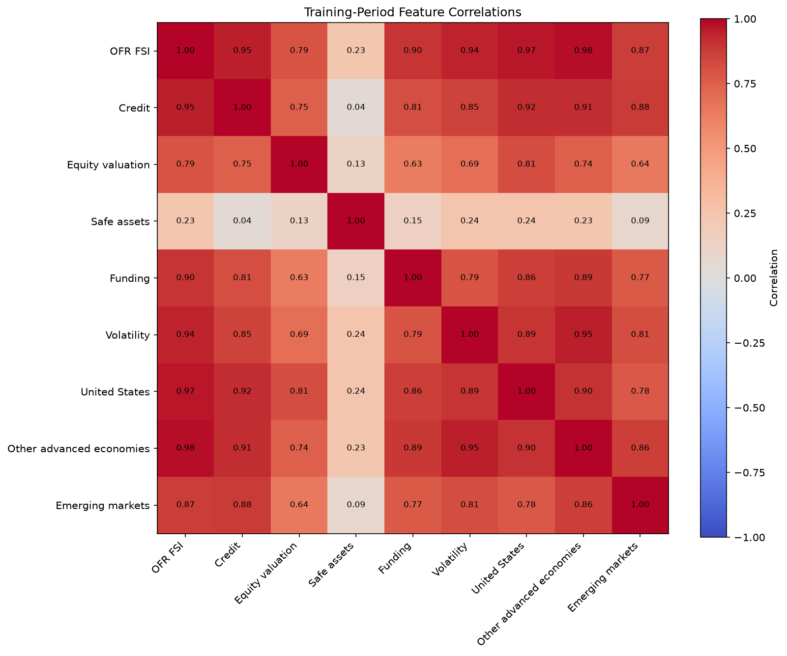
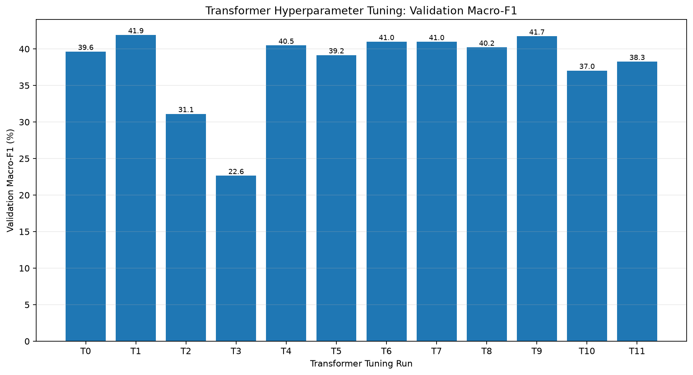
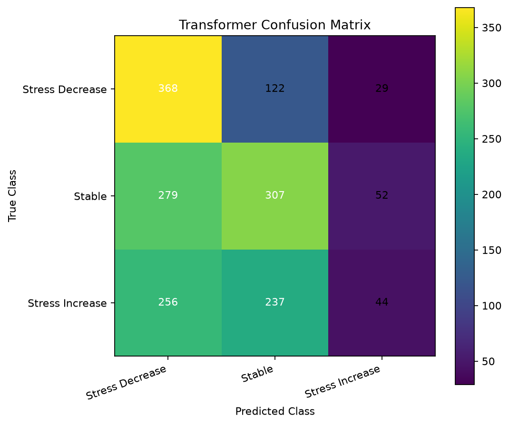
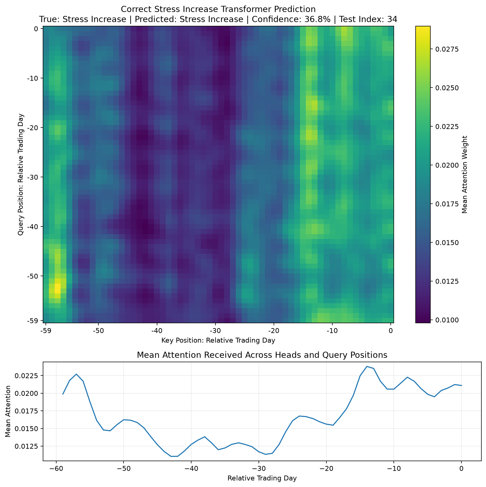
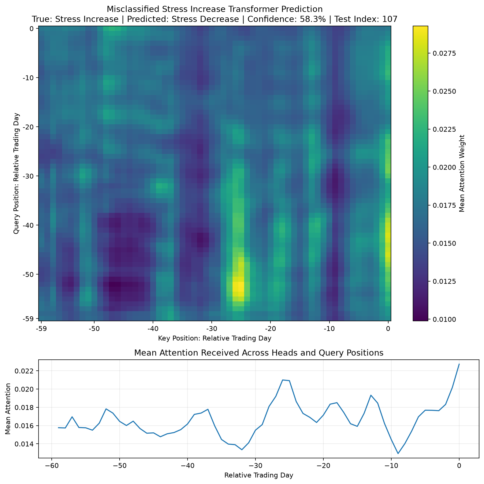
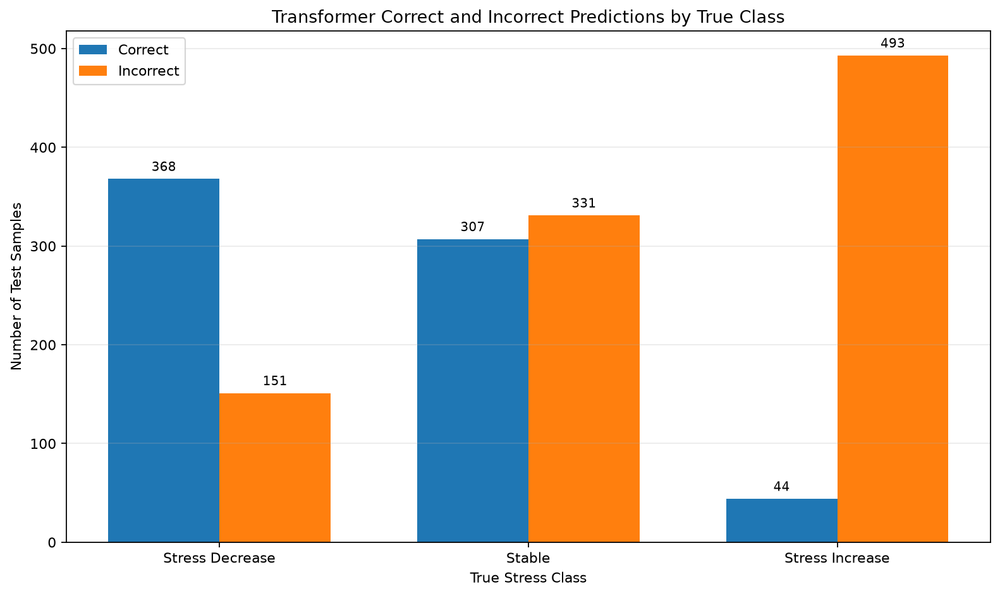
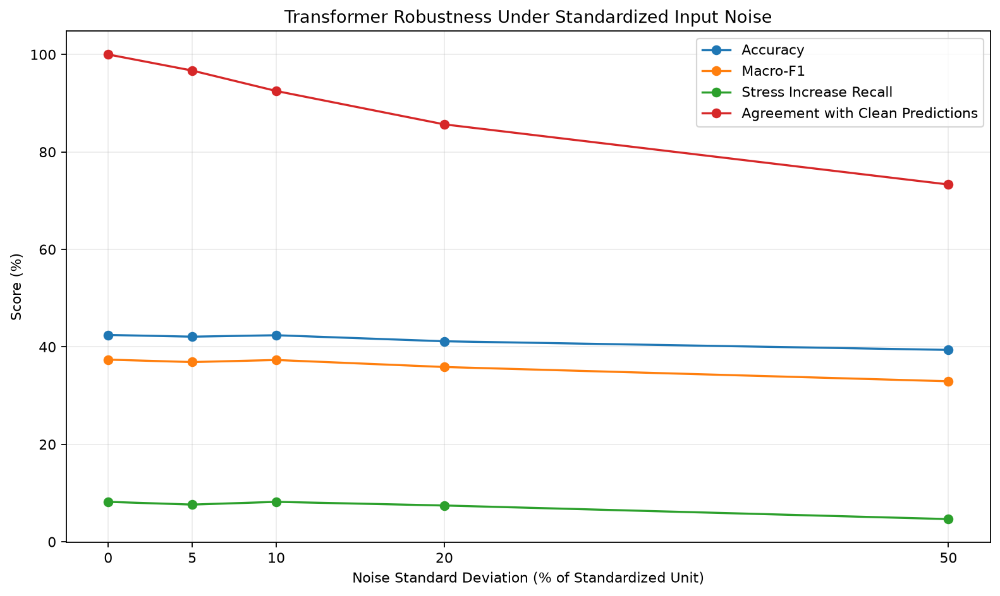

# Financial Stress Regime Forecasting with PyTorch

Deep-Learning-Projekt zur Klassifikation zukünftiger Finanzstressregime mit realen Finanzmarktdaten, chronologischer Evaluation und einem Vergleich von MLP, LSTM und Transformer.

## Forschungsfrage

> Kann ein PyTorch-Transformer anhand der vorherigen 60 Handelstage multivariater Finanzstressdaten klassifizieren, ob der Finanzstress über die folgenden fünf Handelstage sinkt, stabil bleibt oder steigt?

## Projektstatus

**Abgeschlossener Deep-Learning-Forschungsprototyp**

Das Projekt demonstriert einen vollständigen und nachvollziehbaren AI-Engineering-Workflow mit:

- realen Finanzdaten
- chronologischer Datenaufteilung
- Leakage-Vermeidung
- reproduzierbaren PyTorch-Modellen
- MLP-Baseline
- LSTM
- Transformer
- Early Stopping
- Hyperparameter-Tuning
- Explainability
- Fehleranalyse
- Robustheitsanalyse
- Responsible AI

Der aktuelle Stand ist ausdrücklich:

- kein Trading-System
- keine Anlageempfehlung
- keine Produktionsanwendung
- kein Nachweis einer profitablen Handelsstrategie

---

## Wichtigste Ergebnisse

Finale Evaluation auf dem chronologisch zurückgehaltenen Testzeitraum:

| Modell | Accuracy | Macro-F1 | Recall Stress Increase |
|---|---:|---:|---:|
| MLP | 43,92 % | 33,44 % | 0,37 % |
| LSTM | **44,33 %** | **37,90 %** | 6,15 % |
| Transformer | 42,44 % | 37,38 % | **8,19 %** |
| Majority-Baseline | 30,64 % | 15,63 % | 0,00 % |

### Zentrale Erkenntnisse

- Das **LSTM** erreicht die beste Gesamtleistung auf dem unbekannten Testset.
- Der **Transformer** erreicht den höchsten Recall für `Stress Increase`.
- Das komplexere Modell ist nicht automatisch das bessere Modell.
- Die Erkennung steigenden Finanzstresses bleibt die wichtigste Modellschwäche.
- Validation- und Testleistung unterscheiden sich sichtbar.
- Kleine standardisierte Eingabestörungen verändern die Gesamtleistung nur begrenzt.
- Attention unterstützt die Interpretation zeitlicher Beziehungen, beweist aber keine Kausalität.



---

## Datengrundlage

Verwendet wird der offizielle **Financial Stress Index des Office of Financial Research (OFR)**.

Datensatzumfang im Projekt:

- 6.730 Beobachtungen
- Zeitraum: 03.01.2000 bis 05.08.2026
- 9 numerische Features
- keine fehlenden Werte
- keine doppelten Datumswerte
- chronologisch sortiert

Verwendete Features:

1. `OFR FSI`
2. `Credit`
3. `Equity valuation`
4. `Safe assets`
5. `Funding`
6. `Volatility`
7. `United States`
8. `Other advanced economies`
9. `Emerging markets`

Die Rohdaten werden lokal gespeichert und nicht in das Git-Repository eingecheckt.

---

## Explorative Datenanalyse

Vor der Modellierung wurden unter anderem untersucht:

- zeitlicher Verlauf des OFR FSI
- Verteilungen
- Feature-Korrelationen
- zukünftige Stressveränderungen
- Klassenverteilung in Training, Validation und Test

Beispielplots:





---

## Zielvariable

Für jeden Zeitpunkt wird die durchschnittliche Entwicklung des OFR FSI über die folgenden fünf Handelstage betrachtet.

```text
zukünftige Stressänderung
=
Mittelwert der nächsten 5 OFR-FSI-Werte
-
aktueller OFR-FSI-Wert
```

Die drei Klassen sind:

```text
0 = Stress Decrease
1 = Stable
2 = Stress Increase
```

Die Klassengrenzen wurden ausschließlich anhand des Trainingszeitraums bestimmt:

```text
untere Grenze ≈ -0,1388
obere Grenze ≈  0,0863
```

Dadurch fließen keine Informationen aus Validation oder Test in die Definition der Zielklassen ein.

---

## Chronologische Datenaufteilung

Bei Finanzzeitreihen werden Vergangenheit und Zukunft nicht zufällig vermischt.

```text
Training:
bis Ende 2016

Validation:
2017 bis Ende 2019

Test:
ab 2020
```

### Leakage-Vermeidung

Umgesetzt wurden unter anderem:

- chronologische Splits
- Zielberechnung separat innerhalb der Splits
- `StandardScaler` ausschließlich auf Trainingsdaten fitten
- Validation und Test nur mit den Trainingsparametern skalieren
- historische Kontextdaten ausschließlich aus der Vergangenheit verwenden
- keine zufällige Vermischung der Zeitreihe

---

## Sliding-Window-Sequenzen

Jede Modellvorhersage verwendet:

```text
60 Handelstage × 9 Features
```

Tensorform:

```text
(samples, timesteps, features)
```

Konkrete Shapes:

```text
Training:
(4213, 60, 9)

Validation:
(749, 60, 9)

Test:
(1694, 60, 9)
```

Klassenverteilung:

```text
Training:
[1406, 1402, 1405]

Validation:
[233, 303, 213]

Test:
[519, 638, 537]
```

Die DataLoader verwenden bewusst:

```python
shuffle=False
```

damit die zeitliche Reihenfolge erhalten bleibt.

---

# Modelle

## 1. MLP-Baseline

Architektur:

```text
60 × 9 Features
      ↓
Flatten
      ↓
540
      ↓
Linear 540 → 128
ReLU
Dropout
      ↓
Linear 128 → 64
ReLU
Dropout
      ↓
Linear 64 → 3
```

Trainierbare Parameter:

```text
77.699
```

Testresultate:

- Accuracy: 43,92 %
- Macro-F1: 33,44 %
- Recall `Stress Increase`: 0,37 %

Das MLP erkennt steigenden Finanzstress nahezu gar nicht.

---

## 2. LSTM

Architektur:

```text
9 Features
    ↓
LSTM
Hidden Size 64
    ↓
letzter Sequenzzustand
    ↓
Linear 64 → 32
ReLU
Dropout
    ↓
Linear 32 → 3
```

Trainierbare Parameter:

```text
21.379
```

Bestes Validation-Ergebnis:

- Best Epoch: 18
- Validation Loss: 1,0437
- Validation Accuracy: 47,40 %

Finale Testmetriken:

- Accuracy: 44,33 %
- Macro Precision: 43,26 %
- Macro Recall: 43,12 %
- Macro-F1: 37,90 %
- Recall `Stress Increase`: 6,15 %

Das LSTM erreicht den besten finalen Macro-F1 der drei neuronalen Modelle.

---

## 3. PyTorch Transformer

Der Transformer ist das Hauptmodell des Projekts.

### Architektur

```text
9 Finanzfeatures
      ↓
Linear Input Projection
      ↓
Model Dimension 64
      ↓
Sinusoidal Positional Encoding
      ↓
Transformer Encoder Block
      ↓
Transformer Encoder Block
      ↓
Mean Pooling über 60 Handelstage
      ↓
Linear 64 → 32
ReLU
Dropout
      ↓
Linear 32 → 3
```

Ein Encoder-Block enthält:

```text
Multi-Head Self-Attention
        ↓
Residual Connection
        ↓
Layer Normalization
        ↓
Feed-Forward Network
        ↓
Residual Connection
        ↓
Layer Normalization
```

Finale Architektur:

```text
Model Dimension:       64
Attention Heads:        4
Encoder Layers:         2
Feed-Forward Size:    128
Classifier Hidden:     32
Dropout:             0,20
Learning Rate:     0,0005
Batch Size:            64
```

Trainierbare Parameter:

```text
69.763
```

### Positional Encoding

Self-Attention kennt die chronologische Reihenfolge nicht automatisch.

Deshalb wird ein sinusoidales Positional Encoding verwendet, das jedem historischen Handelstag Positionsinformationen hinzufügt.

### Multi-Head Self-Attention

Der Transformer verwendet vier Attention Heads.

Für ein Beispiel entstehen Attention-Matrizen der Form:

```text
4 × 60 × 60
```

Jeder der 60 historischen Zeitpunkte kann dadurch Beziehungen zu allen anderen bekannten Zeitpunkten des Eingabefensters modellieren.

---

# Training

Alle Modelle verwenden einen wiederverwendbaren PyTorch-Training-Loop mit:

- `CrossEntropyLoss`
- Adam Optimizer
- Training Loss
- Validation Loss
- Training Accuracy
- Validation Accuracy
- Early Stopping
- Wiederherstellung des besten Modellzustands
- festem Random Seed
- automatischer Device-Auswahl

Device-Priorität:

```text
CUDA
→ MPS
→ CPU
```

Das Training wurde auf Apple Metal Performance Shaders (MPS) durchgeführt.

### Early Stopping

```text
Maximum Epochs: 50
Patience:        7
Min Delta:       0,0001
```

---

# Transformer-Hyperparameter-Tuning

Das Tuning wurde vollständig vor der finalen Testevaluation durchgeführt.

Das Testset wurde nicht zur Modellauswahl verwendet.

Primäres Auswahlkriterium:

```text
Validation Macro-F1
```

Sekundäres Kriterium:

```text
Validation Loss
```

## Ausgangskonfiguration T0

```text
Model Dimension:     64
Attention Heads:      4
Encoder Layers:       2
Feed Forward:       128
Dropout:            0,20
Learning Rate:     0,001
```

Ergebnis:

- Validation Accuracy: 48,46 %
- Validation Macro-F1: 39,63 %
- Recall `Stress Increase`: 7,04 %

## Tuning Stage 1

| Run | Änderung | Val. Accuracy | Val. Macro-F1 | Increase Recall |
|---|---|---:|---:|---:|
| T0 | Ausgangsmodell | 48,46 % | 39,63 % | 7,04 % |
| T1 | Learning Rate 0,0005 | 47,66 % | **41,91 %** | 18,31 % |
| T2 | Model Dimension 128 | 45,93 % | 31,12 % | 0,00 % |
| T3 | 2 Attention Heads | 41,66 % | 22,65 % | 0,47 % |
| T4 | 1 Encoder Layer | 49,53 % | 40,47 % | 7,51 % |
| T5 | Feed Forward 256 | 49,40 % | 39,16 % | 4,23 % |
| T6 | Dropout 0,10 | **50,20 %** | 40,98 % | 8,45 % |

## Tuning Stage 2

| Run | Änderung | Val. Accuracy | Val. Macro-F1 | Increase Recall |
|---|---|---:|---:|---:|
| T7 | Learning Rate 0,00025 | 48,06 % | 40,97 % | 14,08 % |
| T8 | Learning Rate 0,00075 | 49,13 % | 40,21 % | 9,39 % |
| T9 | LR 0,0005 + Dropout 0,10 | 47,66 % | 41,73 % | **20,66 %** |
| T10 | LR 0,0005 + 1 Layer | 44,86 % | 37,04 % | 15,49 % |
| T11 | LR 0,0005 + Dropout 0,10 + 1 Layer | 45,79 % | 38,26 % | 18,31 % |

T1 bleibt die finale Konfiguration, weil bereits vor der Testevaluation der Validation Macro-F1 als primäres Auswahlkriterium festgelegt wurde.



---

# Finale Transformer-Evaluation

Ausgewählte Konfiguration:

```text
T1
```

Validation:

- Best Epoch: 12
- Validation Loss: 1,0518
- Validation Accuracy: 47,66 %
- Validation Macro-F1: 41,91 %
- Recall `Stress Increase`: 18,31 %

Finales Testset:

- Accuracy: 42,44 %
- Macro Precision: 40,68 %
- Macro Recall: 42,41 %
- Macro-F1: 37,38 %

Klassenspezifischer Recall:

```text
Stress Decrease: 70,91 %
Stable:          48,12 %
Stress Increase:  8,19 %
```

Confusion Matrix:

```text
[[368, 122,  29],
 [279, 307,  52],
 [256, 237,  44]]
```



---

# Majority-Baseline

Die Majority-Baseline wird ausschließlich anhand der häufigsten Klasse im Trainingsset bestimmt.

Trainings-Majority:

```text
Stress Decrease
```

Testleistung:

- Accuracy: 30,64 %
- Macro Precision: 10,21 %
- Macro Recall: 33,33 %
- Macro-F1: 15,63 %

---

# Explainability

Der finale Transformer kann Attention Maps zurückgeben.

Analysiert wurden:

- eine korrekt erkannte `Stress Increase`-Vorhersage
- eine falsch klassifizierte tatsächliche `Stress Increase`-Beobachtung
- klassenspezifische Fehler
- häufigste Fehlklassifikationen

## Korrektes Stress-Increase-Beispiel

Modellwahrscheinlichkeiten:

```text
Stress Decrease: 27,77 %
Stable:          35,40 %
Stress Increase: 36,83 %
```



## Falsch klassifiziertes Stress-Increase-Beispiel

Tatsächliche Klasse:

```text
Stress Increase
```

Vorhersage:

```text
Stress Decrease
```

Wahrscheinlichkeiten:

```text
Stress Decrease: 58,34 %
Stable:          13,84 %
Stress Increase: 27,81 %
```

Dieses Beispiel zeigt:

> Eine höhere Modellkonfidenz garantiert keine korrekte Vorhersage.



## Attention-Interpretation

Attention-Gewichte werden als Interpretationshilfe verwendet.

Sie beweisen nicht:

- Kausalität
- wirtschaftliche Ursache-Wirkungs-Beziehungen
- direkte Feature Importance

---

# Fehleranalyse

Korrekte Vorhersagen des Transformers:

```text
Stress Decrease:
368 / 519 = 70,91 %

Stable:
307 / 638 = 48,12 %

Stress Increase:
44 / 537 = 8,19 %
```

Häufigste Fehlklassifikationen:

```text
Stable → Stress Decrease:          279
Stress Increase → Stress Decrease: 256
Stress Increase → Stable:          237
Stress Decrease → Stable:          122
Stable → Stress Increase:           52
Stress Decrease → Stress Increase:  29
```

Von 537 tatsächlichen Stressanstiegen erkennt der Transformer nur 44 korrekt.



---

# Robustheitsanalyse

Der finale Transformer wurde auf Empfindlichkeit gegenüber kontrollierten Eingabestörungen getestet.

Dazu wurde Gaußsches Rauschen auf die bereits standardisierten Features gegeben.

Das Modell wurde dabei:

- nicht neu trainiert
- nicht weiter optimiert
- nicht anhand der Robustheitsergebnisse verändert

| Rauschen | Accuracy | Macro-F1 | Increase Recall | Prediction Agreement |
|---:|---:|---:|---:|---:|
| 0 % | 42,44 % | 37,38 % | 8,19 % | 100,00 % |
| 5 % | 42,09 % | 36,88 % | 7,64 % | 96,69 % |
| 10 % | 42,38 % | 37,31 % | 8,19 % | 92,50 % |
| 20 % | 41,15 % | 35,87 % | 7,45 % | 85,66 % |
| 50 % | 39,37 % | 32,94 % | 4,66 % | 73,32 % |

Kleine Störungen verändern die Gesamtleistung nur begrenzt. Größere Störungen führen zunehmend zu abweichenden Entscheidungen.



---

# Limitationen

## Begrenzte Modellleistung

Der beste Test-Macro-F1 liegt unter 40 %.

Die Modelle demonstrieren einen vollständigen Forschungsworkflow, sind aber nicht produktionsreif.

## Schwache Stress-Increase-Erkennung

Alle Modelle besitzen Schwierigkeiten bei der Erkennung steigenden Finanzstresses.

## Nichtstationäre Finanzmärkte

Beziehungen zwischen Variablen können sich über unterschiedliche Marktregime hinweg verändern.

## Begrenzter Feature-Raum

Aktuell werden ausschließlich neun OFR-Merkmale verwendet.

Nicht enthalten sind beispielsweise:

- Leitzinsen
- Zinsstrukturkurven
- Inflation
- Arbeitsmarktdaten
- zusätzliche Credit Spreads
- weitere Volatilitätsdaten
- Unternehmensfundamentaldaten
- Nachrichten oder Textinformationen

## Fester Prognosehorizont

Der aktuelle Prognosehorizont beträgt fünf Handelstage.

## Festes historisches Fenster

Die Modelle verwenden ein 60-Handelstage-Fenster.

## Attention ist keine Kausalität

Attention erklärt interne Modellbeziehungen, aber keine wirtschaftlichen Ursache-Wirkungs-Zusammenhänge.

## Synthetischer Robustheitstest

Gaußsches Rauschen bildet reale Finanzkrisen oder strukturelle Brüche nicht vollständig ab.

## Keine Trading-Performance

Das Projekt untersucht keine:

- Renditen
- Transaktionskosten
- Slippage
- Positionsgrößen
- Drawdowns
- Sharpe Ratio
- Portfolioallokationen

Die Modellleistung ist daher kein Nachweis einer profitablen Trading-Strategie.

---

# Fairness

Der OFR-Datensatz enthält aggregierte Finanzmarktinformationen und keine personenbezogenen Merkmale.

Klassische personenbezogene Fairnessmetriken sind deshalb für die aktuelle Aufgabe nicht direkt anwendbar.

Sollten Modelloutputs zukünftig Entscheidungen über einzelne Kunden, Kreditnehmer oder Versicherungsnehmer beeinflussen, wäre eine separate Fairnessanalyse notwendig.

---

# Responsible AI

Das Modell ist kein autonomes Finanzentscheidungssystem.

Vorhersagen können falsch sein.

Für eine zukünftige produktive Anwendung wären zusätzliche Sicherheits- und Governance-Bausteine notwendig:

- Data Quality Monitoring
- Model Monitoring
- Drift Detection
- Model Versioning
- reproduzierbare Inferenz
- Confidence Monitoring
- Fallback-Regeln
- menschliche Kontrolle

---

# Drei zentrale nächste Schritte

## 1. Stress-Increase-Erkennung verbessern

Höchste Priorität ist die Verbesserung des Recalls für steigenden Finanzstress.

Mögliche Experimente:

- zusätzliche Features
- alternative Klassengrenzen
- andere historische Fenstergrößen
- weitere Sequenzarchitekturen
- weitere Ansätze für schwierige Klassen

## 2. Datenbasis erweitern

Zukünftige Versionen könnten zusätzliche Finanz- und Makrodaten integrieren:

- Leitzinsen
- Staatsanleiherenditen
- Zinsstrukturkurven
- Inflation
- Arbeitsmarktdaten
- Volatilitätsindikatoren
- Kreditmarktinformationen

## 3. Walk-Forward-Evaluation

Statt nur eines festen Splits könnte eine spätere Version mehrere chronologisch aufeinanderfolgende Trainings- und Testperioden verwenden.

```text
Trainieren
    ↓
Validieren
    ↓
auf Zukunft testen
    ↓
Zeitfenster nach vorne verschieben
    ↓
wiederholen
```

---

# Projektstruktur

```text
deep-learning-critical-systems/
├── artifacts/
│   ├── checkpoints/
│   └── logs/
├── data/
├── reports/
│   ├── discussion.md
│   └── figures/
├── src/
│   └── deep_learning_critical_systems/
│       ├── data/
│       ├── evaluation/
│       ├── models/
│       └── training/
├── tests/
├── pyproject.toml
└── README.md
```

---

# Technischer Stack

- Python 3.13
- PyTorch 2.13
- NumPy
- pandas
- scikit-learn
- Matplotlib
- seaborn
- pytest
- certifi
- Git
- GitHub
- Apple Metal Performance Shaders (MPS)

---

# Installation

Repository klonen:

```bash
git clone https://github.com/Maik-Huebner/deep-learning-critical-systems.git
cd deep-learning-critical-systems
```

Virtuelle Umgebung erstellen:

```bash
python -m venv .venv
```

Aktivieren unter macOS/Linux:

```bash
source .venv/bin/activate
```

Projekt installieren:

```bash
pip install -e .
```

---

# Daten laden und analysieren

```bash
python -m deep_learning_critical_systems.data.load_ofr_fsi
python -m deep_learning_critical_systems.data.explore_ofr_fsi
```

---

# Modelle trainieren

MLP:

```bash
python -m deep_learning_critical_systems.training.train_mlp
```

LSTM:

```bash
python -m deep_learning_critical_systems.training.train_lstm
```

Transformer Baseline:

```bash
python -m deep_learning_critical_systems.training.train_transformer
```

---

# Transformer-Tuning

Stage 1:

```bash
python -m deep_learning_critical_systems.training.tune_transformer
```

Stage 2:

```bash
python -m deep_learning_critical_systems.training.tune_transformer_stage2
```

---

# Evaluation

```bash
python -m deep_learning_critical_systems.evaluation.evaluate_mlp
python -m deep_learning_critical_systems.evaluation.evaluate_lstm
python -m deep_learning_critical_systems.evaluation.evaluate_transformer
python -m deep_learning_critical_systems.evaluation.compare_models
```

Explainability:

```bash
python -m deep_learning_critical_systems.evaluation.analyze_transformer_explainability
```

Robustheit:

```bash
python -m deep_learning_critical_systems.evaluation.analyze_transformer_robustness
```

Transformer-Plots:

```bash
python -m deep_learning_critical_systems.evaluation.plot_transformer_results
```

---

# Tests

```bash
pytest -q
```

Aktueller Stand:

```text
58 passed
```

---

# Reproduzierbarkeit

Das Projekt verwendet einen festen Random Seed:

```text
42
```

Weitere Maßnahmen:

- chronologische Splits
- train-only Scaling
- fest definierte Zielgrenzen
- dokumentierte Modellarchitekturen
- gespeicherte Training Histories
- gespeicherte Checkpoints
- dokumentierte Hyperparameter
- reproduzierbare Tuning-Runs
- automatisierte Tests

GPU-/MPS-Ausführungen können trotz festem Seed je nach Hardware und Bibliotheksversion minimale numerische Unterschiede erzeugen.

---

# Ausführliche Diskussion

Die ausführliche deutschsprachige Diskussion mit:

- Ergebnissen
- Hyperparameter-Tuning
- Generalisierung
- Explainability
- Robustheit
- Limitationen
- Fairness
- Responsible AI
- nächsten Schritten

befindet sich unter:

```text
reports/discussion.md
```

---

# Portfolio

Projektseite:

https://maik-huebner.de/projects/deep-learning-critical-systems

---

# Autor

**Maik Hübner**

AI Engineering
Machine Learning
Deep Learning
Python
PyTorch
Financial AI
