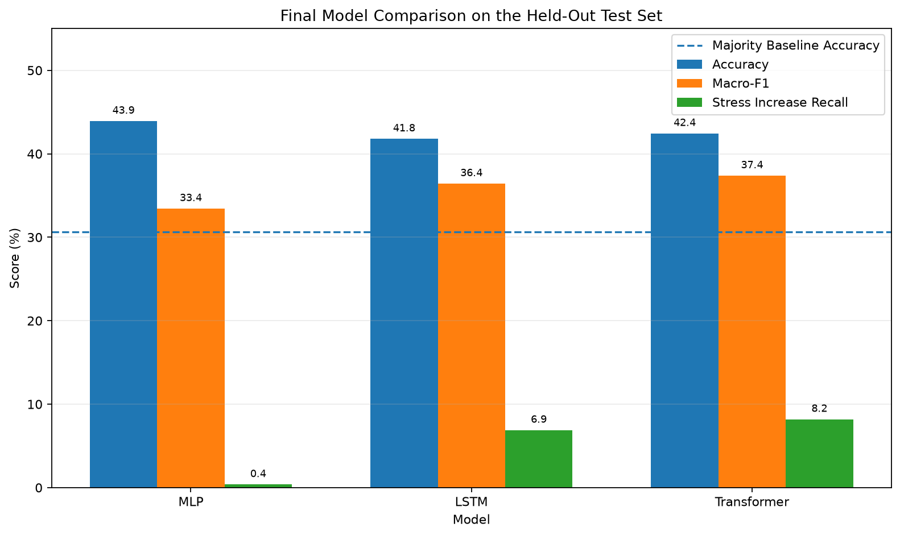

# Financial Stress Regime Forecasting with PyTorch

An auditable Deep-Learning research and portfolio prototype that classifies the
next five-observation direction of the Office of Financial Research Financial
Stress Index from the preceding 60 trading days.

**Stack:** Python 3.13 · PyTorch · pandas · scikit-learn · Matplotlib

**Models:** MLP baseline · LSTM · Transformer encoder

**Versioned evidence:** 6,730 observations · 1,694 held-out test sequences

**Scope:** research prototype; no investment, trading or regulatory use

## Executive summary

The project asks whether multivariate OFR FSI history can distinguish future
stress decrease, stability and increase. It implements a chronological pipeline,
train-only preprocessing, validation-only model selection, three neural models,
post-selection error/ROC/temporal/attention/robustness analyses and machine-
verifiable report evidence.

The result is deliberately not oversold. The Transformer leads the three neural
models on Macro-F1, stress-increase recall and Macro ROC-AUC, yet its Macro-F1 is
only 37.38% and it detects 44 of 537 actual stress increases. The engineering
value is the traceable experiment and honest failure analysis, not a claim of
operational financial forecasting.

| Model | Accuracy | Macro-F1 | Increase recall | Macro ROC-AUC |
|---|---:|---:|---:|---:|
| MLP | **43.92%** | 33.44% | 0.37% | 0.5801 |
| LSTM | 41.79% | 36.43% | 6.89% | 0.5970 |
| Transformer | 42.44% | **37.38%** | **8.19%** | **0.6183** |
| Training-majority baseline | 30.64% | 15.63% | 0.00% | n/a |



## Workflow

```text
OFR fsi.csv
  -> schema, date, duplicate and missing-value checks
  -> frozen/canonical snapshot verification
  -> chronological train / validation / test split
  -> split-local five-observation future target
  -> training-tertile class thresholds
  -> train-fitted StandardScaler
  -> 60 x 9 past-only windows
  -> MLP / LSTM / Transformer training and validation selection
  -> one held-out test evaluation
  -> versioned evidence + post-hoc diagnostics
```

## Data source and provenance

The source is the [OFR Financial Stress Index](https://www.financialresearch.gov/financial-stress-index/),
a daily market-based measure built from financial-market indicators. The project
downloads the official CSV directly and does not redistribute it.

The reference analysis is frozen at 2026-08-05:

| Property | Value |
|---|---|
| Rows | 6,730 |
| Raw CSV SHA-256 | `2d4a955fb0d72993fae454a731628d1deb4aca980a19121b989e80de09bf8478` |
| Canonical snapshot SHA-256 | `38535be9eadd819493c3b77e11885deb14e344d97007551f87c76700cc829c9c` |
| Features | OFR FSI + 5 categories + 3 regions (9 total) |
| Missing required values / duplicate dates | 0 / 0 |

OFR updates and can revise the live series. A newer download may contain later
rows; the pipeline truncates it at the cutoff and verifies the canonical hash.
Historical revisions fail validation instead of silently changing the experiment.
See [DATA_CARD.md](docs/DATA_CARD.md) for field, licensing and limitation details.

## Target and leakage protection

For date `t`:

```text
future stress change = mean(OFR FSI[t+1:t+5]) - OFR FSI[t]
```

Training-target tertiles define the classes `Stress Decrease`, `Stable` and
`Stress Increase` (thresholds approximately -0.1388 and 0.08627).

| Split | Calendar boundary | Prediction dates | Shape |
|---|---|---|---|
| Train | through 2016 | 2000-03-28–2016-12-22 | `(4213, 60, 9)` |
| Validation | 2017–2019 | 2017-01-03–2019-12-23 | `(749, 60, 9)` |
| Test | 2020 onward | 2020-01-02–2026-07-29 | `(1694, 60, 9)` |

The implementation is designed to avoid the leakage modes explicitly audited:

- no random time split;
- labels are calculated independently inside each split, so horizons do not
  cross split boundaries;
- class thresholds and scaling parameters come from training data only;
- validation/test windows may use known earlier context, never future rows;
- all data loaders preserve sequence order;
- validation selects configurations; held-out test evidence does not.

This is not a claim that every conceivable market-data leakage mode is impossible;
the source is not a point-in-time vintage database. The detailed protocol is in
[METHODOLOGY.md](docs/METHODOLOGY.md).

## Models and training

- **MLP:** flattened `60 x 9` input, hidden layers 128 and 64, 77,699 parameters.
- **LSTM:** hidden size 64 plus a 32-unit classifier, 21,379 parameters.
- **Transformer:** 64-dimensional projection, four heads, two encoder blocks,
  128-unit feed-forward blocks and mean pooling, 69,763 parameters.

All use cross-entropy, Adam, early stopping, restored best validation state and
seeded Python/NumPy/PyTorch generators. Tuning uses validation Macro-F1 with
validation loss as tie-breaker. The LSTM finalists L1 and L9 were additionally
checked over seeds 42, 123 and 2026; L1's mean validation Macro-F1 was
0.2875 ± 0.0715 versus 0.2813 ± 0.0768 for L9. That spread is evidence of seed
sensitivity, not stability.

## Final evaluation and error analysis

Confusion matrices use rows as actual and columns as predicted classes in the
order decrease, stable, increase:

```text
MLP          [[196, 323,   0],   LSTM         [[299, 174,  46],
              [ 92, 546,   0],                  [231, 372,  35],
              [ 93, 442,   2]]                  [205, 295,  37]]

Transformer  [[368, 122,  29],
              [279, 307,  52],
              [256, 237,  44]]
```

The MLP's headline Accuracy comes mainly from predicting `Stable`; it identifies
only two stress increases. The Transformer improves increase recall to 8.19%, but
256 increases are called decreases and 237 are called stable. Stable-to-decrease
(279 cases) is its other dominant error. These asymmetric failures make the model
unsuitable for decisions where missed stress escalation is costly.

ROC-AUC is somewhat better than hard-label performance: the Transformer has the
best macro value (0.6183), while LSTM has the best stress-increase class AUC
(0.5632). These modest ranking results do not override the poor decision recall.

## Explainability

The repository visualizes Transformer attention for one correct and one missed
stress increase and summarizes class-wise errors. Attention is a descriptive view
of internal token relationships. It does not establish causality and must not be
treated as direct feature importance. The selected correct example is itself
low-confidence (36.83%), while one incorrect decrease prediction reaches 58.34%.

## Robustness

Gaussian noise is added to standardized test inputs without retraining:

| Noise σ | Accuracy | Macro-F1 | Increase recall | Clean agreement |
|---:|---:|---:|---:|---:|
| 0.00 | 42.44% | 37.38% | 8.19% | 100.00% |
| 0.05 | 42.09% | 36.88% | 7.64% | 96.69% |
| 0.10 | 42.38% | 37.31% | 8.19% | 92.50% |
| 0.20 | 41.15% | 35.87% | 7.45% | 85.66% |
| 0.50 | 39.37% | 32.94% | 4.66% | 73.32% |

This is one synthetic sensitivity check, not evidence of robustness to crises,
missing data, adversaries or structural market change.

## Temporal generalization

Yearly results vary materially. Transformer increase recall is 41.57% in 2021,
but zero in 2023, 2025 and the partial 2026 period. Transformer Macro-F1 ranges
from 26.37% to 38.38%; LSTM Macro-F1 ranges from 28.72% to 37.96%. This supports
the presence of temporal nonstationarity and argues for walk-forward validation
before any broader use. Full values are in
[temporal_generalization.md](reports/temporal_generalization.md).

## Reproducibility and evidence

Tracked JSON under `reports/evidence/` contains the final metrics, snapshot
metadata, tuning selection, seed stability, ROC-AUC, temporal, attention and
noise-study results. `manifest.json` hashes every evidence file. These files were
exported only after directly rerunning the frozen local checkpoints.

Raw data, checkpoints and full training logs remain ignored because they are
source-controlled poorly and may have separate rights or excessive size.

```bash
# Offline: no raw data, checkpoint or network required
python scripts/reproduce_evidence.py

# Validate and rewrite only the comparison figure
MPLBACKEND=Agg python scripts/reproduce_evidence.py --write

# Maintainer-only, after recreating ignored local experiment artifacts
python scripts/export_reference_evidence.py
```

## Installation

Python 3.13 is the supported runtime. The lock file captures the exact audited
runtime and developer toolchain.

```bash
python3.13 -m venv .venv
source .venv/bin/activate
python -m pip install pip==26.2.1
python -m pip install -r requirements/lock-py313.txt
python -m pip install --no-build-isolation --no-deps -e .
```

To download and verify the data path:

```bash
python -m deep_learning_critical_systems.data.prepare_ofr_fsi
```

The exact raw-file hash applies to the archived reference download. The canonical
snapshot check is what permits a later live file containing additional dates.

## Quality gates

```bash
make quality          # Ruff lint + formatting check
make test             # complete test suite
make evidence-check   # offline evidence integrity and invariants
make audit            # tracked hygiene/obvious-secret guard
make build            # sdist + wheel
```

GitHub Actions runs the same gates on Python 3.13, installs from the exact lock,
builds both distributions and installs the wheel in a new virtual environment.
CI intentionally does not perform costly model retraining.

## Project structure

```text
src/deep_learning_critical_systems/   package: data, models, training, evaluation
tests/                                unit and repository-contract tests
scripts/                              thin audit/evidence maintainer entry points
reports/evidence/                     versioned machine-readable evidence
reports/figures/                      versioned portfolio figures
docs/                                 method, data, model and responsible-use cards
data/                                 ignored local source data
artifacts/                            ignored local checkpoints and full logs
requirements/lock-py313.txt           exact Python 3.13 environment
```

## Responsible use and limits

This repository is not an autonomous financial decision system, investment
advice, regulatory evidence or a profitable trading strategy. It lacks
point-in-time source vintages, external validation, calibration guarantees,
monitoring, operational controls and human-governance processes. See
[MODEL_CARD.md](docs/MODEL_CARD.md) and
[RESPONSIBLE_USE.md](docs/RESPONSIBLE_USE.md).

## License

Source code and project documentation are available under the [MIT License](LICENSE).
The OFR data is downloaded from its source and not relicensed or redistributed by
this repository; review the [Data Card](docs/DATA_CARD.md) before use.
